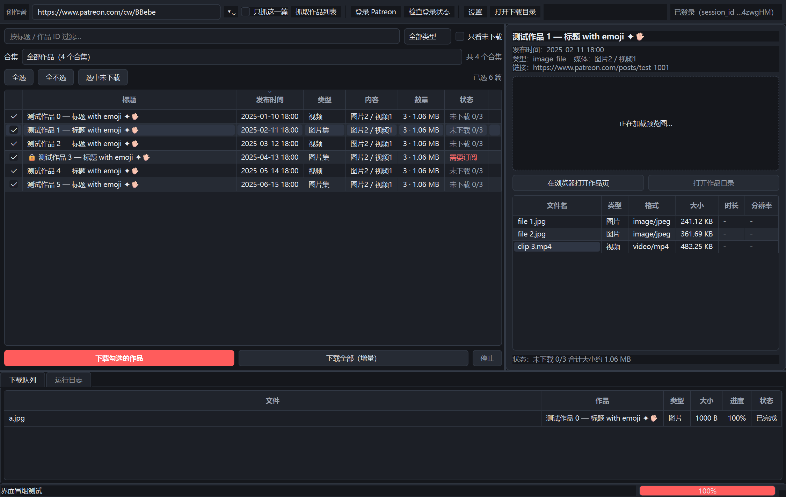

# Patreon 内容下载器

用 **Python + PySide6 (Qt 6)** 写的桌面程序，批量抓取并下载 Patreon 创作者的作品——图片、视频、音频、附件都支持。

程序内置 **QtWebEngine 浏览器**：在里面登录 Patreon，自动捕获 `session_id` 等凭证并保存在本机，之后就能访问你**有权访问**的付费内容。



> ⚠️ 仅供备份**你自己有权访问**的内容。请遵守 Patreon 服务条款与创作者的作品许可，不要用于传播或转售。

---

## 功能

| 功能 | 说明 |
| --- | --- |
| 内置浏览器登录 | 程序内登录 patreon.com，自动抓取 Cookie（含 HttpOnly 的 `session_id`），持久化保存，下次免登录 |
| 全量抓取 | 输入创作者主页 / 名字 / 数字 ID，分页抓取全部作品 |
| 单篇抓取 | 粘贴任意作品链接（含分享链接），只抓这一篇并自动勾选，整场只要 **1 个请求** |
| 合集浏览 | 按创作者整理的合集（Collections）筛选作品；粘贴合集链接可**一次请求**抓回整个合集 |
| 内容识别 | 图片（原图 / 大图 / 中图）、mux 完整版视频、直链视频、音频、附件 |
| 正文内嵌媒体 | 新版编辑器把多个视频写进正文（如「索引贴」），程序解析正文并逐个取回 |
| 按部分分目录 | 一篇含多个部分时，按正文标题自动分组，每组一个子目录 |
| 批量下载 | 多线程并发、断点续传、自动重试、清晰度回退 |
| 增量同步 | 按「下载目录内的相对路径」判断已下载，换目录也不用重下 |
| 归档 | 可选输出 `post.txt`（正文）与 `post.json`（元数据 + 媒体清单） |
| 外链视频 | 可选调用 yt-dlp 下载 YouTube / Vimeo 等嵌入视频 |

## 快速开始

需要 Python 3.9+（[下载](https://www.python.org/downloads/)，安装时勾选 *Add Python to PATH*）。

1. 双击 **`setup.bat`** —— 自动创建虚拟环境并装依赖（首次约 250 MB）
2. 双击 **`run.bat`** —— 启动程序
3. 工具栏点 **「登录 Patreon」** → 登录 → **「完成并保存凭证」**

> 出问题用 **`run-debug.bat`**（保留控制台，能看到报错）。
> 显卡/驱动导致内置浏览器黑屏时，加 `--software` 改用软件渲染。

命令行等价步骤：

```bat
python -m venv .venv
.venv\Scripts\python.exe -m pip install -r requirements.txt
.venv\Scripts\python.exe main.py
```

### Linux / macOS

程序本身是跨平台的（QtWebEngine、ffmpeg、yt-dlp 都有对应版本，
代码里的 Windows 专用处理都用 `os.name` / `sys.platform` 做了守卫），
但**目前只在 Windows 上实测过**。其它平台用附带的 shell 脚本：

```bash
chmod +x setup.sh run.sh   # 克隆后如果缺少可执行权限
./setup.sh                 # 创建虚拟环境并安装依赖
./run.sh                   # 启动程序
```

内置浏览器加载失败时，Ubuntu / Debian 通常需要补系统库：

```bash
sudo apt install libnss3 libxkbcommon-x11-0 libegl1 libgl1 libasound2
```

打包同理（PyInstaller 会产出对应平台的可执行文件）：

```bash
.venv/bin/python -m pip install -r requirements-build.txt
.venv/bin/python tools/build_exe.py
```

> `tools/build_exe.py` 给产物写的中文启动脚本是 Windows 的 `.bat`，
> 在其它平台可以忽略那一项。

## 使用

### 1. 登录

点 **「登录 Patreon」**，两种方式任选：

- **内置浏览器登录（推荐）**：正常登录即可。成功时底部显示
  `✅ 已捕获登录凭证（含 session_id）`，点「完成并保存凭证」。
- **手动粘贴 Cookie**：在已登录的浏览器按 `F12` → *Application* → *Cookies* →
  `https://www.patreon.com`，复制 `session_id` 的值，粘成 `session_id=xxxx` 即可。

保存后点 **「检查登录状态」** 可验证。凭证只存在本机 `data/cookies.json`，不会上传。

### 2. 抓取

用输入框右侧的 **「只抓这一篇」** 复选框切换模式：

**模式 A：抓整个创作者**（不勾选）

| 填什么 | 例子 |
| --- | --- |
| 创作者名字 | `BBebe` |
| 主页地址 | `https://www.patreon.com/cw/BBebe` |
| 数字 ID | `122089` |

→ 抓取该创作者**全部作品**，列在表格里任你挑选。

**模式 B：只抓某一篇**（粘贴作品链接会自动勾上）

```
https://www.patreon.com/BBebe/posts/exclusive-videos-141949666?utm_medium=clipboard_copy&...
```

→ 只请求这一篇，表格里只有它，并且**自动勾选**，直接点下载即可。

**模式 C：抓某个合集**

合集（Collections）是创作者给自己作品做的分类，比如这个创作者有
`| Femdom |`（70 篇）、`| Exclusive Videos |`（59 篇）、`| Other K!nks |`（71 篇）。
两种用法：

- **直接粘合集链接**（`https://www.patreon.com/collection/2084280`）→
  **一次请求**抓回该合集全部作品，并自动在下拉框里选中它；
- 或者先加载创作者，再用表格上方的 **「合集」下拉框**切换。
  切到还没加载过的合集会自动去抓；切回「全部作品」看全部。

> 合集链接里带 `?view=expanded` 之类的参数不影响。

| | 模式 A（主页） | 模式 B（单篇） | 模式 C（合集） |
| --- | --- | --- | --- |
| 请求数 | 1 个主页 + 每页 1 个 | **1 个** | **1 个**（另加 1 个列合集） |
| 适合 | 批量备份、增量同步 | 只想拿某一篇 | 只想拿某一类（按题材/系列） |

> `/c/`、`/cw/`、`/user` 这类路径前缀会自动去掉，跳转也会自动跟随；
> Patreon 分享按钮带的 `?utm_*` 参数一律忽略，不影响结果。

### 3. 下载

- 表格第一列勾选作品；上方有 **「全选 / 全不选 / 选中未下载」**
- **「下载勾选的作品」** 只下勾选的；**「下载全部（增量）」** 下当前筛选下的全部
  （已下过的自动跳过）
- 右侧面板显示选中作品的详情、预览图和媒体清单；下方是下载队列与运行日志
- 下载中点 **「停止」** 可安全中断，已下载的部分保留，下次继续

### 换下载目录

「已下载」按 **下载目录内的相对路径** 判断（例如
`NSFW VTuber Roleplay Videos\2026-10-03_标题\01_封面.png`），
每次都用**当前**设置的下载目录去解析它：

| 情况 | 结果 |
| --- | --- |
| 整个目录搬到 `E:\bb`，设置改成 `E:\bb` | ✅ 依然算已下载 |
| 只搬了一部分 | 搬过去的算已下载，其余会重下 |
| 只改设置、没搬文件 | ❌ 全部算未下载 |
| 文件不在当前下载目录里 | ❌ 一律不算（哪怕旧目录里还在） |

## 设置

「设置」分四个标签页：

| 标签页 | 主要项目 |
| --- | --- |
| **基本** | 下载目录、同时下载数、请求间隔、每页数量、最多抓取数、超时、重试、代理 |
| **下载内容** | 图片 / 视频 / 音频 / 附件 / 预览片段 / 封面图 / **正文内嵌媒体**、图片画质、**视频优先 mux 完整版**、ffmpeg 路径、yt-dlp |
| **命名与归档** | 四个命名模板、每篇作品单独子目录、**帖子内多部分时每部分单独子目录**、写 `post.json` / `post.txt` |
| **行为与外观** | 跳过已下载、校验大小、完成后打开目录、主题 |

两个容易忽略但重要的开关：

- **正文里内嵌的媒体**（默认开）——新版编辑器把图片/视频直接写进正文，
  这类媒体**不在**作品的关系字段里，必须逐个额外请求才能拿到。关掉会漏内容。
- **帖子内含多个部分时，每个部分单独建子目录**（默认关）——像
  [索引贴](https://www.patreon.com/BBebe/posts/exclusive-videos-141949666)
  这种一篇塞 21 个视频的，会按正文里每个视频前面的标题分组：

```
2025-10-24_[Exclusive Videos ] List of all old videos...\
├── 01_Your Bratty Girlfriend Loves Bond*ge ... Voiced\
│      └── 01_Bondage GF 1 EX.mp4
├── 06_Bully Series Arcs ( School Uniform Outfit ) - Part 1 [Handj*b] _\
│      └── 01_Bully Sports 1 EX.mp4
├── 09_School Festival Arc _ - Part 1 [Handj*b] _     ← 与 06 同名，靠上级标题区分
└── 01_cover.png                                       ← 封面没有对应部分，留在根目录
```

## 命名模板

| 项目 | 默认模板 | 可用变量 |
| --- | --- | --- |
| 创作者目录 | `{creator}` | `{creator}` `{vanity}` `{campaign_id}` `{post_id}` `{title}` `{date}` `{datetime}` `{year}` `{month}` `{day}` `{post_type}` |
| 作品目录 | `{date}_{title}` | 同上 |
| 文件名 | `{index:02d}_{name}` | 额外 `{index}` `{name}` `{stem}` `{ext}` `{kind}` `{media_id}` |
| 部分子目录 | `{index:02d}_{title}` | `{index}` `{title}` `{name}` `{section}` |

**三个目录模板都支持多层**：用 `/` 或 `\` 分隔就会真的分出子文件夹
（两种分隔符在 Windows 和 Linux 上等价）。例如「作品目录」设成
`{year}/{month}/{date}_{title}`，结果是：

```
<下载目录>\<创作者>\2026\10\2026-10-05_标题\
```

文件名模板不支持分层（会被安全化成一个名字）。

不想要部分目录的序号，把「部分子目录」改成 `{title}` 即可。

## 打包成独立 exe

双击 **`build.bat`**（约 45 秒），产物在 `dist\PatreonDownloader\`，
**整个文件夹拷到任意 Windows 机器都能跑，不需要装 Python**。

```bat
build.bat              rem 默认，无控制台窗口
build.bat --console    rem 保留控制台，首次打包或排查问题建议用这个
```

打包后自检（检查 Qt 插件、网络库和**内置浏览器**）：

```bat
dist\PatreonDownloader\PatreonDownloader.exe --selftest
```

报告写在 `dist\PatreonDownloader\data\logs\selftest.log`，退出码 `0` 表示全部通过。
体积约 **470 MB**——其中 194 MB 是 QtWebEngine（Chromium）本身，属正常。

更多细节见 [docs/打包说明.md](docs/打包说明.md)。

## 常见问题

**内置浏览器空白 / 黑屏？**
加 `--software` 启动，或改用「手动粘贴 Cookie」标签页，功能完全一样。

**提示「需要订阅」或某篇没有媒体？**
当前账号缺少该作品所在订阅等级的权限。确认用**有权限的账号**登录后，点「检查登录状态」验证。

**某篇里几十个视频抓不到，只显示一张图？**
那篇用的是新版富文本正文，媒体以 `media_id` 内嵌在正文里、**不在关系字段**中。
程序会自动解析并逐个取回（设置里「正文内嵌媒体」保持开启）。
想给每个视频单独一个文件夹，再打开「帖子内含多个部分时…」。

**合集里的作品会不会抓不到？**
不会——合集是创作者对**已有作品**的分类，里面的作品本来就在主页列表里
（实测这个创作者 18 个合集、去重 133 篇，100% 都在主页列表的 152 篇内）。
合集的价值在于**按题材挑**，比如只下 `| Femdom |` 那 70 篇。
界面上的「合集」下拉框就是干这个的；粘合集链接还能少跑几个请求。

**视频只有几十秒？**
确认设置里 **「视频优先下载 mux 完整版」已勾选**。仍然拿不到，通常说明该作品对你不可见。

**下载下来是 `.ts` 而不是 `.mp4`？**
部分视频用 mux 的受保护播放，**不提供任何静态 MP4**，只能取 HLS 分片（且是 MPEG-TS）。
装上 **ffmpeg** 并加入 PATH 后，程序会自动无损封装成 MP4；没装就保留 `.ts`
（VLC / PotPlayer 都能播放，也可手动 `ffmpeg -i a.ts -c copy a.mp4`）。

**下载报 403 / 429？**
`403` = 媒体签名过期或该媒体对你不可见，重新抓取一次列表即可刷新签名；
`429` = 被限流，程序会自动等待重试，也可以把「请求间隔」调大、「同时下载数」调小。

**改了 `.bat` 里的中文后报 `'et' 不是内部或外部命令`？**
编码问题。`cmd.exe` 按系统 ANSI 代码页读取批处理文件，`.bat` 必须是
**GBK 编码 + CRLF 换行**，且不能写 `chcp`。别手改，改 `tools/make_bat.py` 再运行：

```bat
.venv\Scripts\python.exe tools\make_bat.py
```

**想用命令行自检抓取链路？**

```bat
.venv\Scripts\python.exe tests\live_check.py https://www.patreon.com/cw/BBebe
.venv\Scripts\python.exe tests\live_check.py https://www.patreon.com/cw/BBebe --collections
.venv\Scripts\python.exe tests\live_check.py "https://www.patreon.com/collection/2084280" --collection --download
.venv\Scripts\python.exe tests\live_check.py "<作品链接>" --post --download
```

## 项目结构

```
main.py  run.bat  run-debug.bat  setup.bat  build.bat  patreon_dl.spec
         run.sh   setup.sh                              （Linux / macOS）
patreon_dl\
├── config.py       配置与路径      ├── ui\
├── models.py       数据模型        │   ├── app.py             入口 / 自检
├── patreon.py      API 客户端      │   ├── main_window.py     主窗口
├── extract.py      媒体提取        │   ├── login_window.py    内置浏览器登录
├── downloader.py   下载引擎        │   ├── settings_dialog.py 设置
├── naming.py       命名模板        │   ├── post_model.py      表格模型
├── metadata.py     归档输出        │   ├── theme.py           主题
├── state.py        增量状态        │   └── workers.py         后台线程
├── cookies.py      Cookie 处理     └── util.py
tests\   test_extract.py  test_state.py  gui_smoke.py  live_check.py
tools\   build_exe.py     make_bat.py
docs\    技术细节.md      打包说明.md
data\    运行时数据（自动创建，已在 .gitignore 中）
```

## 技术说明

程序直接调用 Patreon 网页版的 JSON:API（`/api/posts`、`/api/campaigns/{id}`、
`/api/media/{id}`、`/api/current_user`），用内置浏览器拿到的 Cookie 认证。

媒体地址的来源、mux 受保护播放（DRM）的识别、新版富文本正文的解析、
增量判断的相对路径机制等**实现细节**，见 [docs/技术细节.md](docs/技术细节.md)。

## 免责声明

- 本工具仅用于**备份你自己有权访问的内容**，请遵守 Patreon 服务条款
  以及创作者对作品的使用许可。
- 请勿用于传播、转售或任何侵犯创作者版权的用途。
- 请保持克制的请求频率，不要对 Patreon 服务器造成压力。

## 许可证

[MIT](LICENSE) © 2026 Journalofstars
